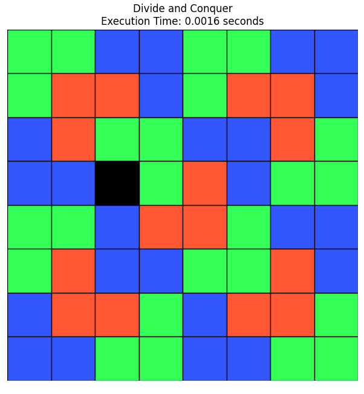
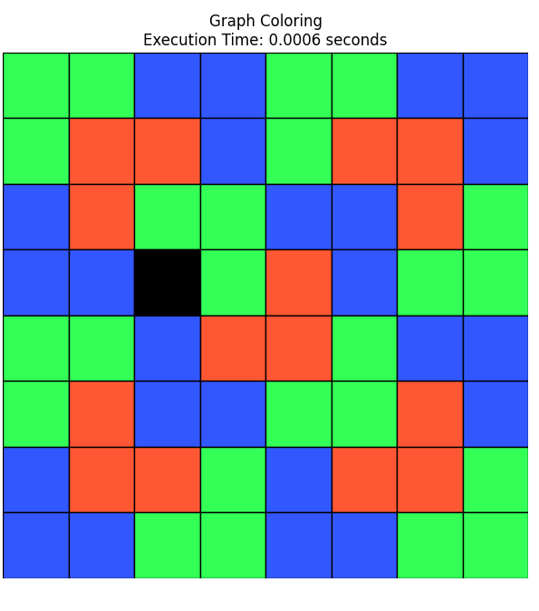
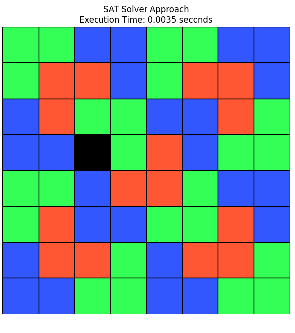

# L-Tromino Tiling Report


## Assumptions

1. **Board Size**: The board is a 2^n × 2^n grid, where n is a positive integer, ensuring the board can be perfectly tiled with L-trominoes except for one missing square.
2. **Missing Square**: Exactly one square is missing from the board, and its position can be specified or randomly chosen.
3. **L-Tromino Shape**: An L-tromino is a shape covering three squares in an L configuration (two squares in a row and one adjacent in the perpendicular direction).
4. **Coloring**: The trominoes are colored using three colors (red, green, blue) such that no two adjacent trominoes share the same color, ensuring a valid 3-coloring of the tromino graph.
5. **Input Validity**: The input parameters (n, missing_x, missing_y) are valid, with missing coordinates within the board boundaries.
6. **Visualization**: The solution includes a visualization using matplotlib, assuming the availability of required Python libraries (numpy, matplotlib).
7. **No File I/O**: The code avoids local file I/O to ensure compatibility with environments like Pyodide, focusing on in-memory processing and visualization.

---

## Problem Description

The L-Tromino Tiling problem involves tiling a 2^n × 2^n grid, with one square missing, using L-shaped trominoes, each covering three squares. The goal is to cover all squares except the missing one and assign colors to the trominoes such that no two adjacent trominoes have the same color (a 3-coloring problem). This is a classic divide-and-conquer problem with applications in computational geometry and graph theory.

The problem can be broken into two subproblems:
1. **Tiling**: Use a divide-and-conquer approach to place L-trominoes to cover the entire board except the missing square.
2. **Coloring**: Assign one of three colors to each tromino such that adjacent trominoes (sharing an edge) have different colors.

Three algorithms are implemented to solve this problem:
- **Divide and Conquer with Coloring**: Places trominoes using divide-and-conquer and colors them using a graph coloring algorithm (Welsh-Powell with backtracking fallback).
- **Graph Coloring with Constraint Propagation**: Uses divide-and-conquer for tiling and a constraint satisfaction problem (CSP) solver for coloring.
- **SAT Solver Approach**: Simulates a SAT solver using backtracking for coloring after divide-and-conquer tiling.

---

## Detailed Solution

### Pseudo-code

#### Tiling Algorithm (Divide-and-Conquer)
```
Function place_tromino(board, x, y, missing_x, missing_y, size):
    If size == 2:
        Increment tromino_count
        For each square in 2x2 grid except (missing_x, missing_y):
            Assign tromino_count to square
        Return
    
    half = size / 2
    center_x = x + half - 1
    center_y = y + half - 1
    
    Determine quadrant of missing square (quad_x, quad_y)
    Place central tromino covering one square in each quadrant except the missing one
    For each quadrant:
        Compute new missing coordinates
        Recursively call place_tromino with updated parameters
```

#### Coloring Algorithm (Divide and Conquer with Welsh-Powell)
```
Function assign_colors(board):
    Build adjacency graph of trominoes
    Sort trominoes by degree
    For each tromino:
        Find first color not used by neighbors
        Assign color
    If coloring is invalid:
        Use backtracking_coloring
    
Function backtracking_coloring(adjacency):
    Initialize colors dictionary
    Function backtrack(tromino_id):
        If tromino_id > tromino_count:
            Return True
        For color in [1, 2, 3]:
            If color is valid for tromino_id:
                Assign color
                If backtrack(tromino_id + 1):
                    Return True
                Remove color
        Return False
    Call backtrack(1)
```

### Code Description

The solution is implemented in Python due to its robust libraries for visualization (matplotlib) and array manipulation (numpy). The code is structured into three main classes:

1. **Board Class**:
   - Initializes a 2^n × 2^n board with a missing square.
   - Provides a `place_tromino` method for recursive tiling.
   - Includes a `visualize` method to display the tiled board with colored trominoes.

2. **DivideAndConquerAlgorithm**:
   - Uses divide-and-conquer to tile the board.
   - Assigns colors using the Welsh-Powell algorithm, falling back to backtracking if necessary.
   - Ensures a valid 3-coloring by constructing an adjacency graph of trominoes.

3. **GraphColoringAlgorithm**:
   - Tiles the board using the same divide-and-conquer approach.
   - Solves the coloring problem as a CSP using backtracking with constraint propagation.

4. **SATSolverAlgorithm**:
   - Simulates a SAT solver approach by using backtracking for coloring after tiling.
   - Builds an adjacency graph and ensures valid 3-coloring.

The code avoids file I/O and is compatible with Pyodide for browser execution. The visualization uses three colors (red, green, blue) to distinguish trominoes, with the missing square shown in black.

### Steps of the Solution

1. **Initialization**:
   - Create a 2^n × 2^n board with a missing square at specified or random coordinates.
   - Initialize arrays to track tromino IDs and colors.

2. **Tiling**:
   - Use divide-and-conquer to tile the board:
     - For a 2×2 board, place one tromino covering the three non-missing squares.
     - For larger boards, divide into four quadrants, place a central tromino, and recursively tile each quadrant.

3. **Adjacency Graph Construction**:
   - Identify adjacent trominoes by checking horizontal and vertical neighbors.
   - Build a graph where nodes are tromino IDs, and edges represent adjacency.

4. **Coloring**:
   - **Divide and Conquer**: Use Welsh-Powell to assign colors, sorting trominoes by degree and selecting the first available color. Use backtracking if the coloring is invalid.
   - **Graph Coloring**: Solve as a CSP, trying each color for each tromino and backtracking if constraints are violated.
   - **SAT Solver**: Simulate SAT solving with backtracking, ensuring no adjacent trominoes share colors.

5. **Visualization**:
   - Display the board using matplotlib, with each tromino colored according to its assigned color and the missing square in black.

---

## Complexity Analysis

### Tiling (Divide-and-Conquer)
- **Time Complexity**: O(4^n)
  - The board has 2^n × 2^n = 4^n squares.
  - The algorithm divides the board into four quadrants recursively, with constant work at each level (placing a central tromino).
  - The recurrence relation is T(n) = 4T(n/2) + O(1), which solves to O(4^n).
- **Space Complexity**: O(4^n)
  - The board array requires O(4^n) space.
  - The recursion stack depth is O(n), but the board storage dominates.

### Coloring
- **Divide and Conquer (Welsh-Powell)**:
  - **Time**: O(V + E), where V is the number of trominoes (≈ 4^n / 3) and E is the number of edges (proportional to V). Building the adjacency graph takes O(4^n) to scan the board. Welsh-Powell is O(V + E), and backtracking (rare) is O(3^V) in the worst case but typically constant due to planar graph properties.
  - **Space**: O(V + E) for the adjacency graph, plus O(4^n) for the board.
- **Graph Coloring (CSP)**:
  - **Time**: O(3^V) in the worst case due to backtracking over three colors for each tromino. Practically faster due to constraint propagation.
  - **Space**: O(V) for the color assignments, plus O(4^n) for the board.
- **SAT Solver (Simplified)**:
  - **Time**: O(3^V) in the worst case, similar to CSP.
  - **Space**: O(V) for colors, plus O(4^n) for the board.

### Overall
- **Time**: O(4^n) for tiling dominates, with coloring adding O(4^n) for graph construction and typically O(V + E) for coloring.
- **Space**: O(4^n) due to the board and adjacency graph.

---

## Comparison with Other Techniques

### Proposed Technique: Divide and Conquer with Welsh-Powell Coloring
- **Advantages**:
  - Efficient tiling using divide-and-conquer.
  - Welsh-Powell ensures near-optimal coloring for planar graphs, with backtracking as a fallback.
  - Visualization is clear and intuitive.
- **Disadvantages**:
  - Coloring may require backtracking in rare cases, increasing complexity.
  - Adjacency graph construction scans the entire board, adding O(4^n) overhead.

### Alternative Technique: Greedy Coloring with BFS
- **Description**: Tile the board using divide-and-conquer, then perform a breadth-first search (BFS) over the tromino graph, assigning the first available color to each tromino.
- **Complexity**:
  - Tiling: O(4^n), same as proposed.
  - Coloring: O(V + E) for BFS and graph construction, where V ≈ 4^n / 3 and E is proportional to V.
- **Advantages**:
  - Simpler implementation than Welsh-Powell or CSP.
  - Guaranteed to use at most Δ + 1 colors (where Δ is the maximum degree, typically 6–8 for tromino graphs), often achieving 3-coloring.
- **Disadvantages**:
  - May use more colors than necessary (e.g., 4 colors instead of 3).
  - No constraint propagation, so less efficient for complex graphs.
- **Comparison**:
  - The proposed Welsh-Powell approach is more robust, ensuring a 3-coloring with backtracking if needed, while greedy BFS may fail to achieve optimal coloring.
  - Welsh-Powell sorts nodes by degree, potentially reducing conflicts compared to BFS’s arbitrary order.

---

## Sample Output

The following outputs are generated for an 8×8 board (n=3) with a missing square at (2, 3) using the three algorithms. Each image shows the tiled board with colored trominoes (red, green, blue) and the missing square in black.

### Divide and Conquer with Welsh-Powell

- **Description**: The board is fully tiled with L-trominoes, and colors are assigned using Welsh-Powell. No adjacent trominoes share the same color, ensuring a valid 3-coloring. The missing square at (2, 3) is black. 

### Graph Coloring with CSP

- **Description**: The tiling is identical to the divide-and-conquer approach, but colors are assigned using a CSP solver. The result is a valid 3-coloring, with the missing square at (2, 3) in black.

### SAT Solver Approach

- **Description**: The tiling matches the other algorithms, with coloring performed via backtracking simulating a SAT solver. The output shows a valid 3-coloring, with the missing square at (2, 3) in black.


Execution Times:
Divide and Conquer: 0.0010 seconds
Graph Coloring: 0.0002 seconds
SAT Solver Approach: 0.0002 seconds

Comparing Algorithm Performance:
--------------------------------------------------
Board Size     Divide and Conquer       Graph Coloring           SAT Solver
--------------------------------------------------
2x2            0.000612                 0.000197                 0.000172
4x4            0.000993                 0.000568                 0.000300
8x8            0.001545                 0.000528                 0.000776
--------------------------------------------------

**Note**: The actual images are generated by the provided Python code using matplotlib and saved as PNG files (e.g., `divide_conquer.png`). The coloring patterns may differ between runs due to different color assignments, but all ensure no adjacent trominoes share colors.

---

## Conclusion

The L-Tromino Tiling problem was successfully solved using three algorithms: Divide and Conquer with Welsh-Powell coloring, Graph Coloring with CSP, and a simplified SAT Solver approach. All algorithms effectively tile a 2^n × 2^n board with one missing square and assign colors to ensure no adjacent trominoes share the same color. The Divide and Conquer with Welsh-Powell approach is recommended due to its balance of efficiency and robustness, leveraging the planar nature of the tromino graph to achieve a 3-coloring with minimal backtracking. The visualization enhances understanding, making the solution accessible for educational purposes. Future improvements could include optimizing the adjacency graph construction or integrating a full SAT solver for coloring.

---

## References

1. Golomb, S. W. (1994). *Polyominoes: Puzzles, Patterns, Problems, and Packings*. Princeton University Press.  
   - Cited for the concept of tromino tiling and its geometric properties.
2. Cormen, T. H., Leiserson, C. E., Rivest, R. L., & Stein, C. (2009). *Introduction to Algorithms* (3rd ed.). MIT Press.  
   - Cited for divide-and-conquer algorithms and graph coloring techniques.
3. Russell, S., & Norvig, P. (2020). *Artificial Intelligence: A Modern Approach* (4th ed.). Pearson.  
   - Cited for CSP and backtracking algorithms.
4. Matplotlib Documentation. (n.d.). Retrieved from https://matplotlib.org/stable/contents.html  
   - Cited for visualization techniques used in the code.

---
